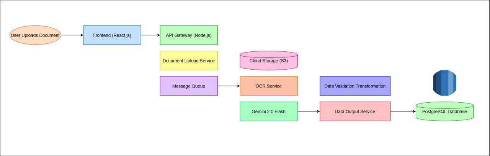

## Data Entry and Processing Automation System: DATAFLOW
---

**Product Vision:**

Our product, named "DataFlow", aims to drastically reduce manual data entry efforts for businesses, enabling them to focus on higher-value activities. We'll achieve this by providing a robust, scalable, and user-friendly platform that automates the extraction, validation, and processing of data from various sources. DataFlow will be built with a focus on:

*   **Accuracy:** Minimizing errors through advanced OCR, NLP, and validation rules.
*   **Speed:** Processing data quickly and efficiently with low latency.
*   **Scalability:** Handling increasing volumes of data and users without performance degradation.
*   **Flexibility:** Supporting a wide range of document types and data formats.
*   **Ease of Use:** Providing an intuitive user interface for configuration and monitoring.
*   **Integration:** Seamlessly integrating with existing business systems (CRMs, accounting software, etc.).
*   **Security:** Ensuring data confidentiality and compliance with industry regulations.

**System Architecture :**

We'll use a microservices architecture for flexibility and scalability.

### 1. Frontend (React.js):

*   **User Interface:** A clean, intuitive dashboard built with React.js,we will shadcn for design consistency.
*   **Key Features:**
    *   **Document Upload:** Drag-and-drop interface for uploading documents (PDFs, images, spreadsheets).
    *   **Workflow Configuration:** A visual workflow builder to define data extraction, validation, and processing steps. Think of this like a simplified version of Zapier or IFTTT, but specifically for data processing.
    *   **Template Management:** Ability to create and manage templates for different document types (e.g., invoices from different vendors).
    *   **Data Mapping:** A visual interface for mapping extracted data fields to database columns or API endpoints.
    *   **Rule Definition:** A user-friendly way to define validation rules (e.g., data type, range, required fields).
    *   **Monitoring Dashboard:** Real-time view of processing status, error rates, and throughput.
    *   **User Management:** Role-based access control (admin, operator, viewer).
    *   **API Keys:** Management of API keys for external integrations.
    *   **Audit Logs:** Tracking all user actions and system events.

### 2. Backend (Node.js with Express.js):

*   **API Gateway:** Handles authentication, authorization, and routing of requests to different microservices.
*   **Microservices:**
    *   **Document Upload Service:** Handles file uploads, stores files in cloud storage (AWS S3) and queues processing tasks.
    *   **OCR Service:** We will use Gemini 2.0 Flash model.
    *   **NLP Service:** We will use Gemini 2.0 Flash model.
    *   **Data Validation Service:** Applies validation rules defined by the user.
    *   **Data Transformation Service:** Transforms data into the desired format.
    *   **Data Output Service:** Writes data to the target destination to Postgres DB.
    *   **Workflow Orchestration Service:** Manages the execution of the entire data processing workflow, coordinating the different microservices. This could leverage a message queue likely Apache Kafka to handle asynchronous tasks.
    *   **Reporting Service:** Generates reports based on processed data.
    *   **User Management Service:** Manages user accounts, roles, and permissions.

### 3. Python Microservice (not in pipeline for now but in future):

*   While Node.js has NLP libraries, Python often offers more mature and performant options for heavy NLP tasks.
*   A dedicated Python microservice (using Flask or FastAPI) can handle complex NLP tasks like:
    *   Named Entity Recognition (NER)
    *   Relationship Extraction
    *   Custom model training (e.g., fine-tuning a BERT model for specific document types)
*   This service would communicate with the Node.js backend via a message queue or REST API.

### 4. Database (PostgreSQL):

*   **Schema Design:** We'll need several tables, designed for flexibility and scalability.

### 5. Message Queue (RabbitMQ/Kafka/AWS SQS):

*   Used for asynchronous communication between microservices.
*   Decouples services, improves resilience, and enables scalability.
*   Example: The Document Upload Service publishes a message to the queue, and the OCR Service consumes the message to process the document.

### 6. Cloud Infrastructure (AWS):

*   **Compute:** Use containerization (Docker) and orchestration (Kubernetes) for deploying and managing microservices.
*   **Storage:** Use cloud storage (S3) for storing uploaded documents.
*   **Database:** Use a managed PostgreSQL service (AWS RDS).
*   **Load Balancing:** Use a load balancer to distribute traffic across multiple instances of the API gateway and microservices.
*   **Auto Scaling:** Configure auto-scaling to automatically adjust resources based on demand.
*   **Monitoring:** Use monitoring tools (CloudWatch) to track system performance and identify issues.
*   **Logging:** Use centralized logging (CloudWatch Logs) to collect and analyze logs from all services.

### Architecture
